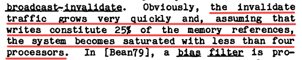

# *MESI PROTOCOL* - READING NOTE

source: [A LOW-OVERHEAD COHERENCE SOLUTION FOR MULTIPROCESSORS
WITH PRIVATE CACHE MEMORIES](./MESI.pdf)

## MESI Protocol Overview
The MESI protocol (Modified, Exclusive, Shared, Invalid) is a widely used cache coherence protocol in multiprocessor systems. It ensures consistency of data stored in multiple caches by defining four possible states for each cache line:

- **Modified (M):** The cache line is present only in the current cache and has been modified; main memory is out of date.
- **Exclusive (E):** The cache line is present only in the current cache and matches main memory.
- **Shared (S):** The cache line may be present in multiple caches and matches main memory.
- **Invalid (I):** The cache line is not valid; it must be fetched from another cache or memory before use.

The protocol manages transitions between these states in response to read and write operations, ensuring that all processors observe a consistent view of memory.

## QUESTIONS AND ANSWERS

### 1. Why we need cache
using cache is a cost-effective way to improve performance.

and Without some type of local memory, it is physically impossible to gain a significant performance advantage through multiple microprocessors on a single bus

### 2. Why SINGLE SHARED CACHE FOR ALL PROCESSORS requires a crossbar
A single shared cache for all processors requires a crossbar to allow multiple processors to access the cache simultaneously without conflicts. The crossbar provides a direct connection between each processor and the cache, enabling parallel access and reducing contention.

### 1. WHY broadcast-invalidate led to SYSTEM BECOMES SATURATED WITH LESS THEN 4 PROCESSORS WHEN WRITES CONSTITUTE 25% OF THE MEMORY REFERENCES

When writes constitute 25% of the memory references, the system becomes saturated with less than 4 processors due to the increased contention for cache lines. Each write operation can potentially invalidate cache lines in other processors, leading to frequent cache misses and requiring more time to fetch data from main memory. As the number of processors increases, the likelihood of cache line invalidation also increases, causing a bottleneck in performance.

write -> cache line invalidation -> cache misses -> main memory fetches -> performance bottleneck

## CONCEPTS
