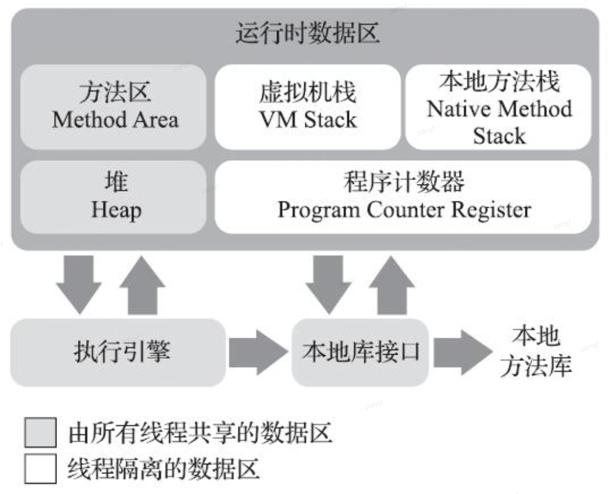

# JVM的内存模型

区别于C/C++这类语言那样将内存管理工作在很大程度上交由程序员去完成，java提供了自动内存管理机制，使得程序员不再需要为每一个new操作去写free/delete代码。因此，JVM为了更好地管理内存地使用，其对内存做了不同区域划分，不同的区域有各自的作用，以及创建和销毁的时间。

## 运行时数据区

JVM中的内存区域，有的是随着虚拟机进程的启动一直存在，有的则是依赖用户线程的启动和结束而建立和销毁的。根据《java虚拟机规范》中的规定，JVM所管理的内存有下面这些运行时数据区域。

 
java虚拟机运行时数据区

### 程序计数器(Program Counter Register)

其功能与CPU中的PC寄存器的功能类似，可以看作当前线程所执行字节码的行号指示器，是线程独立的。如果该线程当前执行的是native方法，这个计数器的值则应该为空(Undefined)。“此内存区域是是唯一一个在《java虚拟机规范》中没有规定任何OutOfMemoryError情况的区域”——《深入理解java虚拟机》

### java虚拟机栈

虚拟机栈是java方法执行的线程内存模型，每个方法被执行的时候，虚拟机都将为方法创建一个栈帧，用于存储局部变量表，操作数帧，动态链接，方法出口等

### 本地方法栈

与虚拟机栈的功能类似，区别在于虚拟机栈是为虚拟机执行java方法服务，而本地方法栈则是为虚拟机使用native方法服务。《java虚拟机规范》中并没有对本地方法栈的实现方式与使用方式做任何强制规定，虚拟机可以根据自身需求自由实现，在hotspot虚拟机中，就是将本地方法栈与虚拟机栈合二为一，因此本地方法栈和虚拟机栈一样，在栈深度溢出与扩展失败时会分别抛出stackOverflowError与OutOfMemoryError异常。

### java堆（java Heap）

java堆是虚拟机所管理的内存中最大的一块，java heap是被所有线程共享的一块内存区域，在虚拟机启动时创建。此区域的唯一目的就是存放对象实例，几乎所有对象实例都是在java堆中分配内存的（但不绝对，由于即时编译等技术的发展，某些时候对象也可能在栈中分配内存）。除此之外，java堆还是垃圾收集器管理的内存区域，由于当前常见的垃圾收集器的实现方式是基于分代收集理论实现的，堆内还会被进一步的划分，因此这里经常会出现“新生代”，“老年代”，“永久代”，“Eden空间”， “From Survivor空间”，“To survivor空间”等名词。值得注意的一点是，这些对堆内区域的划分方式，仅仅是基于垃圾收集器的设计风格，而非java虚拟机具体实现的内存布局，更加不是《java虚拟机规范》里对java堆的进一步细致划分。
