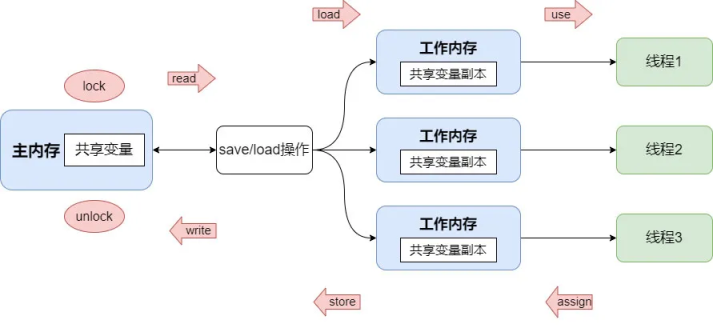

# 并发编程的三大核心问题
在讲述volatile的作用之前，这里先就并发编程如何保证原子性，可见性，有序性的三大核心问题展开铺垫。这里首先先解释这三个“性”分别代表什么含义：

1. **原子性**：是指一个操作是不可被中断，但是在多线程环境下，由于线程的调度，CPU的上下文切换，线程内的多个操作是不能保证被原子执行的。
2. **可见性**：是指当多个线程访问同一个变量时，一个线程修改了该变量的值，其他线程能立即看到修改后的值。
3. **有序性**：即程序的执行按照代码中给出的先后顺序执行。现代的处理器和编译器为了提高程序运行的效率，可能会对代码的执行顺序进行优化（重排序），它不保证程序中各个语句的执行先后顺序是与代码中一致的，但会保证程序最终执行的结果与顺序执行的结果是一样的。

```java
    int a = 10; // 语句1
    int b = 20; // 语句2
    a += 11;    // 语句3
    b *= 2;     // 语句4
```
例如上面的代码中，指令重排可能会使执行顺序为: 1——3——2——4，或者是 1——2——4——3，这些执行顺序都能使最终的执行结果与 1——2——3——4顺序执行的结果相同。

```java
int a = 10; // 语句1
int b = 5;  // 语句2
a += 3;     // 语句3
r *= a;     // 语句4
```
在这段代码中，执行的顺序可能是 2——1——3——4,也可能是1——2——3——4，但不可能是2——1——4——3，也不可能是1——2——4——3。因为这里语句4依赖语句3的执行结果，在进行指令重排时，会考虑到指令之间的依赖关系。

```java
// 线程1
boolean inited = false;
context = loadContext();
inited = true

// 线程2
while (!inited) sleep();
doSomething(context);
```

但是在多线程环境中情况就不一样了，由于线程1中context与inited这两者之间，在代码字面上并没有依赖关系，因此线程1中发生指令重排后可能会导致先执行`inited = true`,再执行`loadContext()`，最终导致线程2在执行`doSomething`时，context可能并未完成初始化，从而引发错误。

# JMM(Java Memory Model)java内存模型
在JAVA中，为了屏蔽各种不同硬件平台和操作系统的内存访问差异，JMM规范了java虚拟机与计算机内存协同工作的流程。


如上图所示，JVM会为每个线程分配一块工作内存，用于存放线程私有数据。此外JMM还规定了所有的变量都是存储在主内存中，主内存是共享的，所有线程都能访问，但不能直接在主内存上进行操作(读取赋值等)，只能在工作内存中进行。因此线程要访问某个共享内存中的变量时，要先将其从主内存中拷贝(read, load)一份到工作内存中，线程在工作内存中完成操作后，再回写(store, write)到主内存中。并且不同线程之间是无法互相访问对方的工作内存的，线程间的通信依赖主内存完成。因此显而易见，在多线程环境下，对主内存中同一个变量进行访问可能会发生线程安全问题，因为这个机制破怪了“可见性”（即使可以直接访问主内存，也会因为CPU的缓存架构产生类似的问题。

# volatile
在java中，volatile关键字主要提供了`可见性`与`有序性`两个能力。但不保证原子性
1. 可见性：被volatile修饰的共享变量被一个线程修改后，其新的值总是可以被其他线程立即感知到。
2. 有序性：可以禁止指令重排优化

下面以几个实际例子进行说明
## 可见性
```java
import java.util.concurrent.TimeUnit;

public class Test {
    private static boolean breaking = false;

    public static void main(String[] args) throws InterruptedException {
        new Thread(() -> {
            System.out.println(Thread.currentThread().getName() + " start");
            while (!breaking);
            System.out.println(Thread.currentThread().getName() + " over");
        }, "thread-1").start();
        TimeUnit.SECONDS.sleep(1);

        new Thread(() -> {
            for (int i = 0; i < 1000000; i++) {
                breaking = true;
            }
            System.out.println(Thread.currentThread().getName() + " update breaking to true");
        }, "thread-2").start();
    }
}
```
运行上面这段代码可以发现，程序输出"thread-2 update breaking to true"后，程序仍未退出运行，说明线程thread-1读取到的breaking变量的状态仍然为false。

但如果使用volatile关键字修饰breaking变量后再次运行这段代码，程序输出"thread-2 update breaking to true"后便退出了运行，这意味着thread-2将breaking设置为true之后thread-1便立即看到了修改后的值。

为了进一步了解volatile的底层工作原理，我们可以使用hsdis-amd64.dll工具，将其放到jre/bin/server的目录中，在运行程序时加上`-XX:+UnlockDiagnosticVMOptions -XX:+PrintAssembly`这两个参数，让程序在运行的时候打印出汇编代码。在输出的汇编代码中搜索breaking，可以找到对breaking变量的赋值汇编指令，使用与不使用volatile修饰的代码分别如下：

- 不使用volatile修饰
```asm
movb   $0x1,0x70(%rdx)              ;*putstatic breaking {reexecute=0 rethrow=0 return_oop=0}
```

- 使用volatile修饰
```asm
mov    $0x1,%r8d
mov    %r8b,0x70(%rdx)
lock addl $0x0,-0x40(%rsp)          ;*putstatic breaking {reexecute=0 rethrow=0 return_oop=0}
```
从上看到使用volatile修饰后，对breaking进行赋值的mov指令后面还有一条`lock addl $0x0,-0x40(%rsp)`的汇编指令，这条指令主要起作用的是这里的lock指令前缀，通过查阅[《intel IA-32开发手册》——（第83版）](https://www.intel.cn/content/www/cn/zh/content-details/819723/intel-64-and-ia-32-architectures-software-developer-s-manual-combined-volumes-1-2a-2b-2c-2d-3a-3b-3c-3d-and-4.html)第三卷第9章，可以得知，LOCK指令前缀的主要作用有：
- 锁定内存总线：对于Intel486和Pentium处理器，强制处理器在执行该指令时锁定内存总线，从而确保在该指令执行之前的所有内存写入操作都已完成。阻止后续操作的执行，直到当前处理器完成其操作。但对于P6家族以及更新的处理器，如果在执行LOCK操作时被锁定的内存区域被执行锁定操作的处理器缓存为写回（write-back）内存，并且完全包含在一个缓存行中，处理器可能不会在总线上发出LOCK#信号。处理器会在内部修改内存位置，并允许其缓存一致性机制(MESI)确保操作的原子性。这种操作被称为“缓存锁定”（cache locking）。
- 使其他CPU的缓存失效：加上LOCK前缀的写操作，会立即回写已修改的数据到内存，同时还会让其他CPU上的相关缓存失效，从而使其他CPU重新从内存中加载最新的数据。

这里LOCK前缀使得其他CPU上的相关缓存，在这条指令执行完成后失效，从而保证了breaking再CPU之间的可见性。

## 指令重排
```java
public class Test {
    static int a = 0, b = 0, x = 0, y = 0;

    public static void main(String[] args) throws InterruptedException {
        boolean result;
        int i = 0;
        do {
            i++;
            Thread thread_1 = new Thread(() -> {
                a = 1;
                x = b;
            });

            Thread thread_2 = new Thread(() -> {
                b = 1;
                y = a;
            });

            thread_1.start();
            thread_2.start();
            thread_1.join();
            thread_2.join();
            result = x == 0 && y == 0;
            a = 0; b = 0; x = 0; y = 0;
        } while (!result);
        System.out.println(i);
    }
}
```

如果没有指令重排，上面这段代码对于x, y的运行结果只会有`x = 1, y = 1`, `x = 1, y = 0`, `x = 0, y = 1`。也就是说，上面这段程序如果没有发生指令重排，应该是一个死循环。但是实际运行可以发现，代码在运行一段时间之后便退出了循环。


## 参考文献
<div id="refer_1"></div>

- [1] [Java 并发编程之 JMM & volatile 详解](https://xie.infoq.cn/article/8b877b5fbe755c382fcee8ddd)

[<sup>1</sup>](#refer_1)