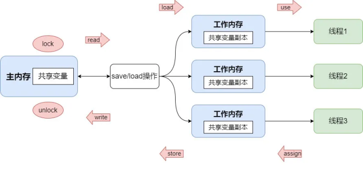

# 并发编程的三大核心问题
在讲述volatile的作用之前，这里先复习一下并发编程如何保证原子性，可见性，有序性的三大核心问题。这里首先先解释这三个特性分别代表什么含义：

1. **原子性**：是指一个操作是不可被中断，但是在多线程环境下，由于线程的调度，CPU的上下文切换，线程内的多个操作是不能保证被原子执行的。
2. **可见性**：是指当多个线程访问同一个变量时，一个线程修改了该变量的值，其他线程能立即看到修改后的值。
3. **有序性**：即程序的执行按照代码中给出的先后顺序执行。现代的处理器和编译器为了提高程序运行的效率，可能会对代码的执行顺序进行优化（重排序），它不保证程序中各个语句的执行先后顺序是与代码中一致的，但会保证程序最终执行的结果与顺序执行的结果是一样的。

```java
    int a = 10; // 语句1
    int b = 20; // 语句2
    a += 11;    // 语句3
    b *= 2;     // 语句4
```
例如上面的代码中，指令重排可能会使执行顺序为: 1——3——2——4，或者是 1——2——4——3，这些执行顺序都能使最终的执行结果与 1——2——3——4顺序执行的结果相同。

```java
int a = 10; // 语句1
int b = 5;  // 语句2
a += 3;     // 语句3
r *= a;     // 语句4
```
在这段代码中，执行的顺序可能是 2——1——3——4,也可能是1——2——3——4，但不可能是2——1——4——3，也不可能是1——2——4——3。因为这里语句4依赖语句3的执行结果，在进行指令重排时，会考虑到指令之间的依赖关系。

```java
// 线程1
boolean inited = false;
context = loadContext();
inited = true

// 线程2
while (!inited) sleep();
doSomething(context);
```

但是在多线程环境中情况就不一样了，由于线程1中context与inited这两者之间，在代码字面上并没有依赖关系，因此线程1中发生指令重排后可能会导致先执行`inited = true`,再执行`loadContext()`，最终导致线程2在执行`doSomething`时，context可能并未完成初始化，从而引发错误。

# JMM(Java Memory Model)java内存模型
在JAVA中，为了屏蔽各种不同硬件平台和操作系统的内存访问差异，JMM规定了java虚拟机与计算机内存协同工作的流程规则。


如上图所示，JVM会为每个线程分配一块工作内存，用于存放线程私有数据。此外JMM还规定了所有的变量都是存储在主内存中，主内存是共享的，所有线程都能访问，但不能直接在主内存上进行操作(读取赋值等)，只能在工作内存中进行。因此线程要访问某个共享内存中的变量时，要先将其从主内存中拷贝(read, load)一份到工作内存中，线程在工作内存中完成操作后，再回写(store, write)到主内存中。并且不同线程之间是无法互相访问对方的工作内存的，线程间的通信依赖主内存完成，这一点与CPU中的缓存架构其实很类似。因此显而易见，在多线程环境下，对主内存中同一个变量进行访问可能会发生线程安全问题，因为这个机制破怪了“可见性”（即使可以直接访问主内存，也会因为CPU的缓存架构产生类似的问题。

# volatile
在java中，volatile关键字主要提供了`可见性`与`有序性`两个能力。但不保证原子性
1. 可见性：被volatile修饰的共享变量被一个线程修改后，其新的值总是可以被其他线程立即感知到。
2. 有序性：可以禁止指令重排优化

下面以几个实际例子进行说明
## volatile与可见性
```java
import java.util.concurrent.TimeUnit;

public class Test {
    private static boolean breaking = false;

    public static void main(String[] args) throws InterruptedException {
        new Thread(() -> {
            System.out.println(Thread.currentThread().getName() + " start");
            while (!breaking);
            System.out.println(Thread.currentThread().getName() + " over");
        }, "thread-1").start();
        TimeUnit.SECONDS.sleep(1);

        new Thread(() -> {
            // 循环多次以触发JIT
            for (int i = 0; i < 1000000; i++) {
                breaking = true;
            }
            System.out.println(Thread.currentThread().getName() + " update breaking to true");
        }, "thread-2").start();
    }
}
```
运行上面这段代码可以发现，程序输出"thread-2 update breaking to true"后，程序仍未退出运行，说明线程thread-1读取到的breaking变量的状态仍然为false。

但如果使用volatile关键字修饰breaking变量后再次运行这段代码，程序输出"thread-2 update breaking to true"后便退出了运行，这意味着thread-2将breaking设置为true之后thread-1便立即看到了修改后的值。

为了进一步了解volatile的底层工作原理，我们可以使用hsdis-amd64.dll工具，将其放到jre/bin/server的目录中，在运行程序时加上`-XX:+UnlockDiagnosticVMOptions -XX:+PrintAssembly`这两个参数，让程序在运行的时候打印出汇编代码。在输出的汇编代码中搜索breaking，可以找到对breaking变量赋值的汇编指令，使用与不使用volatile修饰的代码分别如下：

- 不使用volatile修饰
```asm
movb   $0x1,0x70(%rdx)              ;*putstatic breaking {reexecute=0 rethrow=0 return_oop=0}
```

- 使用volatile修饰
```asm
mov    $0x1,%r8d
mov    %r8b,0x70(%rdx)
lock addl $0x0,-0x40(%rsp)          ;*putstatic breaking {reexecute=0 rethrow=0 return_oop=0}
```
从上看到使用volatile修饰后，对breaking进行赋值的mov指令后面还有一条`lock addl $0x0,-0x40(%rsp)`的汇编指令，这条指令主要起作用的是这里的lock指令前缀，通过查阅[《intel IA-32开发手册》——（第83版）](https://www.intel.cn/content/www/cn/zh/content-details/819723/intel-64-and-ia-32-architectures-software-developer-s-manual-combined-volumes-1-2a-2b-2c-2d-3a-3b-3c-3d-and-4.html)第三卷第9章，可以得知，LOCK指令前缀的主要作用有：
- 锁定内存总线：对于Intel486和Pentium处理器，强制处理器在执行该指令时锁定内存总线，从而确保在该指令执行之前的所有内存写入操作都已完成。阻止后续操作的执行，直到当前处理器完成其操作。但对于P6家族以及更新的处理器，如果在执行LOCK操作时被锁定的内存区域被执行锁定操作的处理器缓存为写回（write-back）内存，并且完全包含在一个缓存行中，处理器可能不会在总线上发出LOCK#信号。处理器会在内部修改内存位置，并允许其缓存一致性机制(MESI)确保操作的原子性。这种操作被称为“缓存锁定”（cache locking）。
- 使其他CPU的缓存失效：加上LOCK前缀的写操作，会立即回写已修改的数据到内存，同时还会让其他CPU上的相关缓存失效，从而使其他CPU重新从内存中加载最新的数据。

这里LOCK前缀使得其他CPU上的相关缓存，在这条指令执行完成后失效，从而保证了breaking再CPU之间的可见性。

## volatile与指令重排
```java
public class Test {
    static int a = 0, b = 0, x = 0, y = 0;

    public static void main(String[] args) throws InterruptedException {
        boolean result;
        int i = 0;
        do {
            i++;
            Thread thread_1 = new Thread(() -> {
                a = 1;
                x = b;
            });

            Thread thread_2 = new Thread(() -> {
                b = 1;
                y = a;
            });

            thread_1.start();
            thread_2.start();
            thread_1.join();
            thread_2.join();
            result = x == 0 && y == 0;
            a = 0; b = 0; x = 0; y = 0;
        } while (!result);
        System.out.println(i);
    }
}
```

如果没有指令重排，上面这段代码对于x, y的运行结果只会有`x = 1, y = 1`, `x = 1, y = 0`, `x = 0, y = 1`。也就是说，上面这段程序如果没有发生指令重排，应该是一个死循环。但是实际运行可以发现，程序在运行一段时间之后便退出了循环，这就是指令重排造成的。要避免指令重排，可以在变量声明时，对变量使用volatile关键字进行修饰。

JMM中，Volatile与监视器（锁）对于指令重排影响的可以由下面这个表格的内容进行表示，虽然它并不代表JMM规则本身，但仍可以帮助你对volatile与指令重排之间的理解。[^3]

<table cellspacing="1" cellpadding="1">
  <tbody>
  <tr>
    <td align="center"><b>Can Reorder</b>
    </td>
    <td colspan="4" rowspan="1" align="center"><em>2nd operation</em>
    </td>
  </tr>
  <tr>
    <td><em>1st operation</em>
    </td>
    <td>Normal Load<br>Normal Store
    </td>
    <td>Volatile Load <br> MonitorEnter
    </td>
    <td>Volatile Store <br> MonitorExit
    </td>
  </tr>
  <tr>
    <td>Normal Load<br>Normal Store
    </td>
    <td><br>
    </td>
    <td><br>
    </td>
    <td>No
    </td>
  </tr>
  <tr>
    <td>Volatile Load <br> MonitorEnter
    </td>
    <td>No
    </td>
    <td>No
    </td>
    <td>No
    </td>
  </tr>
  <tr>
    <td>Volatile store <br> MonitorExit
    </td>
    <td><br>
    </td>
    <td>No
    </td>
    <td>No
    </td>
  </tr>
  </tbody>    
</table>

对非volatile修饰的变量进行读取为Normal Load，写非volatile修饰的变量为Normal Store, volatile的Load/Store同理。编译器通过在这些load/store指令序列中插入内存屏障来禁止某种特定类型的处理器重排序。以实现volatile的禁止重排序的内存语义。

对于内存屏障，通常可以分为以下4种，这里做个简单介绍：
1. **LoadLoad 屏障**
   **指令序列案例**：load1; LoadLoad; load2
   **效果**：LoadLoad屏障可以确保load1涉及的数据一定会在Load2及其后续其他load指令访问的数据加载前加载。

2. **StoreSotre 屏障**
   **指令序列案例**：Store1; StoreStore; Store2
   **效果**：StoreStore屏障可以确保Store1所涉及的的数据在Store2指令及其后续其他Store指令执行前完成Store操作，并对其他所有CPU可见。

3. **LoadStore 屏障**
   **指令序列案例**：Load1; LoadStore; Store1
   **效果**：确保Load1指令所要加载的数据在Store1及其后续其他Store指令执行前完成加载。

4. **StoreLoad 屏障**
   **指令序列案例**: Store1; StoreLoad; Load1
   **效果**: 确保Store1所涉及的数据，在Load1及其其他后续Load指令执行前，完成Store操作，并且对所有CPU立即可见。

JSR-133 JAVA内存模型规范[^7]中所给出的指令排序规则，可以用下表格中所示的逻辑表示。
<table cellspacing="2" cellpadding="2">
  <tbody>
  <tr>
    <td align="center"><b>Required barriers</b>
    </td>
    <td colspan="4" rowspan="1" align="center"><em>2nd operation</em>
    </td>
  </tr>
  <tr>
    <td><em>1st operation</em>
    </td>
    <td>Normal Load
    </td>
    <td>Normal Store
    </td>
    <td>Volatile Load <br> MonitorEnter
    </td>
    <td>Volatile Store <br> MonitorExit
    </td>
  </tr>
  <tr>
    <td>Normal Load
    </td>
    <td><br>
    </td>
    <td><br>
    </td>
    <td><br>
    </td>
    <td><font color="red">LoadStore</font>
    </td>
  </tr>
  <tr>
    <td>Normal Store
    </td>
    <td><br>
    </td>
    <td><br>
    </td>
    <td><br>
    </td>
    <td><font color="red">StoreStore</font>
    </td>
  </tr>
  <tr>
    <td>Volatile Load <br> MonitorEnter
    </td>
    <td><font color="red">LoadLoad</font>
    </td>
    <td><font color="red">LoadStore</font>
    </td>
    <td><font color="red">LoadLoad</font>
    </td>
    <td><font color="red">LoadStore</font>
    </td>
  </tr>
  <tr>
    <td>Volatile Store <br> MonitorExit
    </td>
    <td><br>
    </td>
    <td><br>
    </td>
    <td><font color="red">StoreLoad</font>
    </td>
    <td><font color="red">StoreStore</font>
    </td>
  </tr>
  </tbody>    
</table>

虽然这里给出了4中内存屏障类型，但这些内存屏障并不是在所有CPU架构中，都有一一对应的指令。不同的CPU架构上对指令重排的规则都不太一样，因此在某些CPU上不需要显式地使用某个内存屏障指令来避免重排序（因为它本来就不会进行这种重排），这里以intel X86_64架构CPU为例子。在X86_64处理器中，直接关于内存屏障的指令有`SFENCE, LFENCE, MFENCE`这三个。
- SFENCE: 保证在存储屏障之前的每个存储指令的结果在屏障后之后的任何存储指令执行之前全局可见
- LFENCE: 在保证加载屏障之前指定的所有加载都执行完毕之前，不允许进行加载屏障后的加载
- MFENCE: 确保 MFENCE 之前的所有加载和存储完成并都全局可见之前, MFENCE 之后的任何加载或存储都不会全局可见。
- LOCK: LOCK指令前缀虽然不是内存屏障指令，但通过分析它的作用效果，就能发现LOCK指令前缀自带MFENCE一样的副作用。因此它也是可以用来实现内存屏障效果的。

除了使用volatile关键字，锁也是可以用来达到保证有序性的效果的，上面的表格中也有提到MoniterEntry与MoniterExit。关于这部分，可参考[Synchronization and the Java Memory Model](https://geecs.oswego.edu/dl/cpj/jmm.html)这篇文章。

# 不使用volatile，也不加锁直接显式使用内存屏障
在JDK 8及之后版本的JDK中，Unsafe类提供了直接使用内存屏障的方法，在不同版本中可能有所区别，但JDK 8中有以下这三个方法：`loadFence(), storeFence(), fullFence()`。通过显式地调用这三个方法[^1]，就可以手动插入对应的内存屏障。这里继续以刚才的代码为例子:
```java
import sun.misc.Unsafe;
import java.lang.reflect.Constructor;
import java.lang.reflect.InvocationTargetException;

public class Test {
    static int a = 0, b = 0, x = 0, y = 0;

    public static void main(String[] args) throws InterruptedException, NoSuchMethodException, InvocationTargetException, InstantiationException, IllegalAccessException {
        Class<Unsafe> unsafeClass = Unsafe.class;
        Constructor<Unsafe> declaredConstructor = unsafeClass.getDeclaredConstructor();
        declaredConstructor.setAccessible(true);
        Unsafe unsafe = declaredConstructor.newInstance();

        boolean result;
        int i = 0;
        do {
            i++;
            Thread thread_1 = new Thread(() -> {
                a = 1;
                unsafe.storeFence();
                x = b;
            });

            Thread thread_2 = new Thread(() -> {
                b = 1;
                unsafe.storeFence();
                y = a;
            });

            thread_1.start();
            thread_2.start();
            thread_1.join();
            thread_2.join();
            result = x == 0 && y == 0;
            a = 0; b = 0; x = 0; y = 0;
        } while (!result);
        System.out.println(i);
    }
}
```
这里使用Unsafe提供的方法，在`x = b`与`y = a`之前插入一个store屏障，使`x = b`不会在`a = 1`执行完成之前执行，`y = a`同理。使这段代码等价于使用volatile关键字修饰变量。


## 参考文献
[^1]: [Java 并发编程之 JMM & volatile 详解](https://xie.infoq.cn/article/8b877b5fbe755c382fcee8ddd)
[^2]: [JSR 133: JavaTM Memory Model and Thread Specification Revision
](https://jcp.org/en/jsr/detail?id=133)
[^3]: [The JSR-133 Cookbook for Compiler Writers](https://gee.cs.oswego.edu/dl/jmm/cookbook.html)
[^7]: [JSR-133: JavaTM Memory Model and Thread
Specification](https://www.cs.umd.edu/~pugh/java/memoryModel/jsr133.pdf)