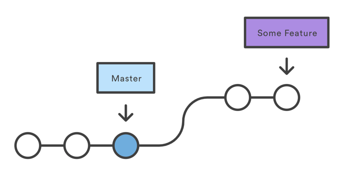
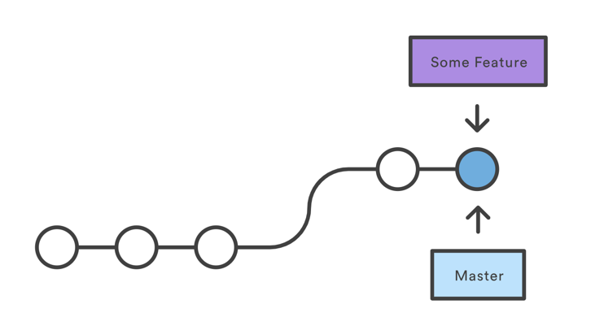

- [1. git起步](#1-git起步)
- [2. git基础](#2-git基础)
  - [2.1. git仓库的初始化](#21-git仓库的初始化)
  - [2.2. 记录每次更新到仓库](#22-记录每次更新到仓库)
  - [2.3. 查看提交历史](#23-查看提交历史)
  - [2.4. 撤销操作](#24-撤销操作)
  - [2.5. 远程仓库](#25-远程仓库)
  - [2.6. 打标签](#26-打标签)
  - [2.7. git别名](#27-git别名)
- [3. git 分支](#3-git-分支)
  - [3.1. git分支的创建与合并](#31-git分支的创建与合并)
    - [3.1.1. git的几种合并策略](#311-git的几种合并策略)
  - [3.2. 分支管理](#32-分支管理)
  - [3.3. 分支开发工作流程](#33-分支开发工作流程)
  - [3.4. 远程分支](#34-远程分支)
  - [git分支变基](#git分支变基)
# 1. git起步
<!-- FIXME: add something here -->

# 2. git基础

## 2.1. git仓库的初始化
- 创建本地仓库

  在要创建仓库的目录下执行
  ```bash
  git init
  ```
- 从现有仓库克隆
  ```bash
  git clone <url>
  ```

- 从远程仓库克隆(自定义本地仓库名)
  ```bash
  git clone <url> <local repository name>
  ```

## 2.2. 记录每次更新到仓库
当在仓库中，对文件进行修改时，文件有两种状态`已跟踪`和`未跟踪`。已跟踪的文件是指纳入了版本控制的文件，上次快照中有它们的记录。  

已跟踪的文件也有两种状态：`已修改`和`未修改`。除了已跟踪的文件，剩下的文件都是未跟踪状态。(新创建的文件)。  

## 2.3. 查看提交历史  

用以下命令查询git提交的历史记录  
```bash
git log
``` 

- 参数
  - `-p`或者`--path`,可选参数 <-2>  
    显示每次提交所引入的差异，<-2>用于限制只显示最近两次提交。（在命令中没有尖括号）  。

  - --stat  
    只显示简略统计信息  

  - --pretty  
    使用不同于默认格式的方式显示提交历史,oneline则将每个提交放在一行显示
    ```bash
    $ git log --pretty=oneline
    ca82a6dff817ec66f44342007202690a93763949 changed the version number
    085bb3bcb608e1e8451d4b2432f8ecbe6306e7e7 removed unnecessary test
    a11bef06a3f659402fe7563abf99ad00de2209e6 first commit
    ```
    - format  
        ```bash
        $ git log --pretty=format:"%h - %an, %ar : %s"
        ca82a6d - Scott Chacon, 6 years ago : changed the version number
        085bb3b - Scott Chacon, 6 years ago : removed unnecessary test
        a11bef0 - Scott Chacon, 6 years ago : first commit  
        ```  
    git log --pretty=format常用选项   

    |选项|说明|
    |---|---|
    |%H|提交的完成的hash值|
    |%h|提交的简写的哈希值|
    |%T|树的完整哈希值|
    |%t|树的简写哈希值|
    |%P|父提交的完整哈希值|
    |%p|父提交的简写哈希值|
    |%an|作者名字|
    |%ae|作者的电子邮箱|
    |%ad|作者修订日期(可以用 --date=<format> 来定制格式)|
    |%ar|作者修订日期，按多久以前的方式显示|
    |%cn|提交者的名字|
    |%ce|提交者的电子邮箱|
    |%cd|提交日期|
    |%cr|提交日期（按距今时常显示）|
    |%s|提交说明|

## 2.4. 撤销操作  
- 提交后发现有缺漏,重新提交：
  ```bash
  git add forgotten_file  
  git commit --amend
  ```  
  将缓冲区中的文件提交，并覆盖原提交信息

- 取消暂存的文件:  
  ```bash
  git reset HEAD <file>
  ```  

- 撤销对文件的修改
  
  ```bash
  git checkout -- <file>
  ```
## 2.5. 远程仓库
- 查看远程仓库
  ```bash
  git remote add origin
  ```
  - 显示URL
    ```bash
    git remote -v
    ```
- 添加远程仓库
  ```bash
  git remote add <shortname> <url>
  ```

- 从远程仓库拉取信息（远程仓库上有，本地没有）  
  ```bash
  git fetch <remote>
  ```  
  fetch命令只会将数据下载到本地，不会自动合并或修改当前工作。需要手动合并到当前的本地分支中。  

  若设置了跟踪远程分支，则可以用`git pull`命令来自动抓取后合远程分支到本地。   

  默认情况下`git clone`命令可以自动设置本地master分支跟踪克隆的远程仓库的master分支，`运行git pull 通常会从最初克隆的服务器上抓取数据并自动尝试合并到当前所在的分支。`
- 推送到远程仓库  
  ```bash
  git push <remote> <brach>
  ```  

  当在push之前，有其他人将提交push到该分支上时，则直接push会失败，需要fetch下来，合并之后再提交。

- 查看某个远程分支  
  
  ```bash
  git remote show <remote repository>
  ```

- 重命名远程仓库
  
  ```bash
  git remote rename <old name> <new name>
  ```  

## 2.6. 打标签
- 列出标签
  ```bash
  git tag (-l/--list)
  ```  
  条件筛选  
  ```bash
  git tag -l "v1.8.5*"
  v1.8.5
  v1.8.5-rc0
  v1.8.5-rc1
  v1.8.5-rc2
  v1.8.5-rc3
  v1.8.5.1
  v1.8.5.2
  v1.8.5.3
  v1.8.5.4
  v1.8.5.5
  ```  

- 创建标签
  - 轻量标签  
    
    不会改变的分支——只是某个特定提交的引用。  

    本质上是将校验和存储到一个文件中——没有保存任何其他信息。创建清凉标签不要使用-a, -s 或者 -m选项，只需要提供标签名字。
    ```bash
    git tag <tag_name>
    ``` 

    若在轻量标签上使用git show,则不会看到任何额外的标签信息，如下所示

    ```bash
    $ git show v1.4-lw
    commit ca82a6dff817ec66f44342007202690a93763949
    Author: Scott Chacon <schacon@gee-mail.com>
    Date:   Mon Mar 17 21:52:11 2008 -0700

        changed the version number
    ```  

  - 附注标签  
    
    在创建标签的时候使用tag命令时，指定-a选项:

    ```bash
    $ git tag -a v1.4 -m "my version 1.4"
    $ git tag
    v0.1
    v1.3
    v1.4
    ```
    -m选项指定了一条将会存储在标签中的信息。若在明命令中没有加上该参数，git则会自动打开编辑器让你输入信息。  

    使用`git show`命令可以看到表亲啊信息和与之相对应的提交信息:  

    ```bash
    $ git show v1.4
    tag v1.4
    Tagger: Ben Straub <ben@straub.cc>
    Date:   Sat May 3 20:19:12 2014 -0700

    my version 1.4

    commit ca82a6dff817ec66f44342007202690a93763949
    Author: Scott Chacon <schacon@gee-mail.com>
    Date:   Mon Mar 17 21:52:11 2008 -0700

        changed the version number
    ```

- 后期打标签  
  ```bash
  git tag -a <tag_name> <部分校验和>
  ```  
- 共享标签

  在默认情况下，git push命令并不会传送标签到远程仓库服务器上。在创建完标签后必须显示地推送标签到共享服务器上。这个过程就像是共享远程分支一样，可以运行一下命令  
  ```bash
  git push origin <tag_name>
  ```

  具体例子如下

  ```bash
  $ git push origin v1.5
  Counting objects: 14, done.
  Delta compression using up to 8 threads.
  Compressing objects: 100% (12/12), done.
  Writing objects: 100% (14/14), 2.05 KiB | 0 bytes/s,    done.
  Total 14 (delta 3), reused 0 (delta 0)
  To git@github.com:schacon/simplegit.git
   * [new tag]         v1.5 -> v1.5
  ```  

  若一次要推送很多标签，可以使用带有--tags选项地`git push`命令。这将会把所有不在远程仓库服务器上地标签全部上传到服务器中。  

- 删除标签  

  删除本地仓库中地标签  
  ```bash
  git tag -d <tag_name>
  ```

  若要同步到远程仓库中：
  - 方法一
  ```bash
  git push <remote> :refs/tags/<tag_name>:
  ```

  该操作的含义是讲冒号前面的空值推送到远程标签名（使用控制替换远程仓库中的标签名），从而高效地删除它。  

  - 方法二
  ```bash
  git push <remote> --delete <tag_name>
  ```

  这种方法比较直观

- 检出标签
  
  查看某个标签指向地文件版本：`git checkout`  

  ```bash
  git checkout 2.0.0
  ```

  但是会导致仓库处于`分离头指针（detached HEAD）`的状态。若在此时做了某些改动并且提交它们，标签不会发生变化，但新的提交将会不属于任何分支，并且将无法访问它们，`除非通过确切的提交哈希才能访问。`因此若需要进行更改，修复旧版本中的错误，通常需要创建一个新分支：
  ```bash
  git checkout -b version2 v2.0.0
  ```
  若在这之后进行了一次提交，version2分支就会因为这次改动向前移动。

## 2.7. git别名  
  
在git中可以使用`git config`文件对命令设置别名，如：
```bash
$ git config --global alias.co checkout
$ git config --global alias.br branch
$ git config --global alias.ci commit
$ git config --global alias.st status
```

这里将checkout设置了别名co,因此可以使用co代替checkout

# 3. git 分支
## 3.1. git分支的创建与合并
- 分支简介
<!-- TODO: git 分支简介 -->
- 分支创建
  
  普通创建方法：
  ```bash
  git branch <new_branch>
  ```

  该操作会在`当前所在的提交对象`上创建一个指针(在当前的提交对象上创建一个分支)

  新建一个分支并且切换到该分支上:

  ```bash
  git checkout -b <new_branch>
  ```
- 分支合并
  
  切换到被合并的目标分支,如:

  ```bash
  git checkout master
  ```
  然后使用`git merge`命令进行合并。

  ```bash
  git merge <target>
  ```
  若本次合并为Fast-forward模式，\<target>分支上的内容将会合并到master上(Fast-forward模式下master指针将指向target的提交，详情请见下文的"git的几种合并策略")  

  若在合并中产生冲突：

  若在合并中git检测到冲突，git则会在冲突文件上展示冲突部分（当前分支上）。使用<<<<<<<<<<<<冲突内容>>>>>>>>>>>>进行展示冲突的部分使用=======隔开。可以使用普通编辑器打开，将冲突解决。也可以使用mergetool（基于vim）图形化工具进行三方合并。


### 3.1.1. git的几种合并策略
<!-- TODO: git 冲突解决方法 -->
1. Fast-forward
   
   <div align = "center">
     
   </div>  

   当合并没有分叉分支时，如图，git只需要将master指向最后一个提交节点上。  

   <div align = "center">
     
   </div>  

   `Fast-forward是git在合并两个没有分叉的分支时的默认策略`，可以使用`git merge --no-ff`取消  

   实例二：
   <div align = "center">
     
   </div>

   在该场景中，git也是使用fast forward模式进行合并（hotfix合并到master）

   <div align = "center">
     
   </div>
   
2. Recursive  
   
   Recursive是git分支合并策略中最常用的策略。git在合并两个有分叉的分支时，Recursive是默认合并策略。  

   其算法可以简述为：递归寻找路径最短的唯一共同祖先节点，然后以其为base进行递归三向合并。  

   <div align = "center">
     
   </div>

   如上图中所示，若iss53分支要合并到master中，则会使用recursive模式进行合并。  

   这种情况下，git会找到master和iss53的公共祖先节点C2作为基准，用C2,C4,C5做一个三方合并 

   <div align = "center">
     
   </div>

   若这个过程中没有发现冲突，则合并完成。本次合并模式为recursive模式。  

   <div align = "center">
     
   </div>

   
   
3. Ours
4. Octopus

## 3.2. 分支管理

- 列出分支列表
  ```bash
  git branch
  ```
- 查看每个分支最后一次提交：
  ```bash
  git branch -v
  ```
- 查看列表中已经合并或者未合并的分支
  ```bash
  git branch --merged
  ```
  ```bash
  git branch --no-merged
  ```
- 删除分支
  ```bash
  git branch -d <branch_name>
  ```
  （使用-d删除分支时，若分支有未合并内容则会失败,可以使用-D强制删除）

## 3.3. 分支开发工作流程
使用git 进行版本控制，通常都会给项目设置几个平行的长期分支。

比如master用于项目的稳定版本的发布，develop或者next用于下一个版本的测试版，nightly用于每日更新的分支版本等。

对于某个模块的开发工作，通常创建一个新的分支用于开发工作，例如iss41,hotfix等，当完成开发工作后，将工作分支（主题分支）合并到主干分支上，然后删除主题分支。

## 3.4. 远程分支
- 显式获取远程i引用的完整列表
  ```bash
  git ls-remote <remote>
  ```
  若要获取更多远程分支的信息
  ```bash
  git remote show <remote>
  ```
- 远程跟踪分支


## git分支变基
