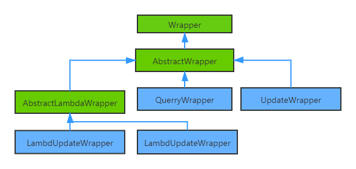

## MyBatis-Plus条件构造器
- 结构图
    

- *说明：* 绿色为抽象类，蓝色为一般类；箭头所指为父类。
- Wrapper：条件构造器父类
- AbstractWrapper：QuerryWrapper和UpdateWrapper的父类，用于生成sql的where条件，entity属性也用于生成sql的where条件。
- AbstractLambdaWrapper ：Lambda 语法使用 Wrapper统一处理解析 lambda 获取 column。
- LambdaQueryWrapper ：Lambda形式的查询Wrapper。
- LambdaUpdateWrapper ：Lambda 形式的更新Wrapper。
- QueryWrapper ：继承自 AbstractWrapper ,自身的内部属性 entity 也用于生成 where 条件及 LambdaQueryWrapper, 可以通过 new QueryWrapper().lambda() 方法获取。  
- UpdateWrapper ： 继承自 AbstractWrapper ,自身的内部属性 entity 也用于生成 where 条件及 LambdaUpdateWrapper, 可以通过 new UpdateWrapper().lambda() 方法获取。