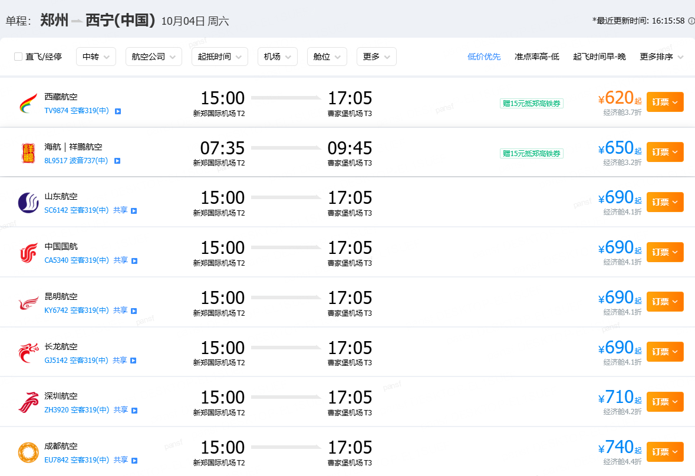
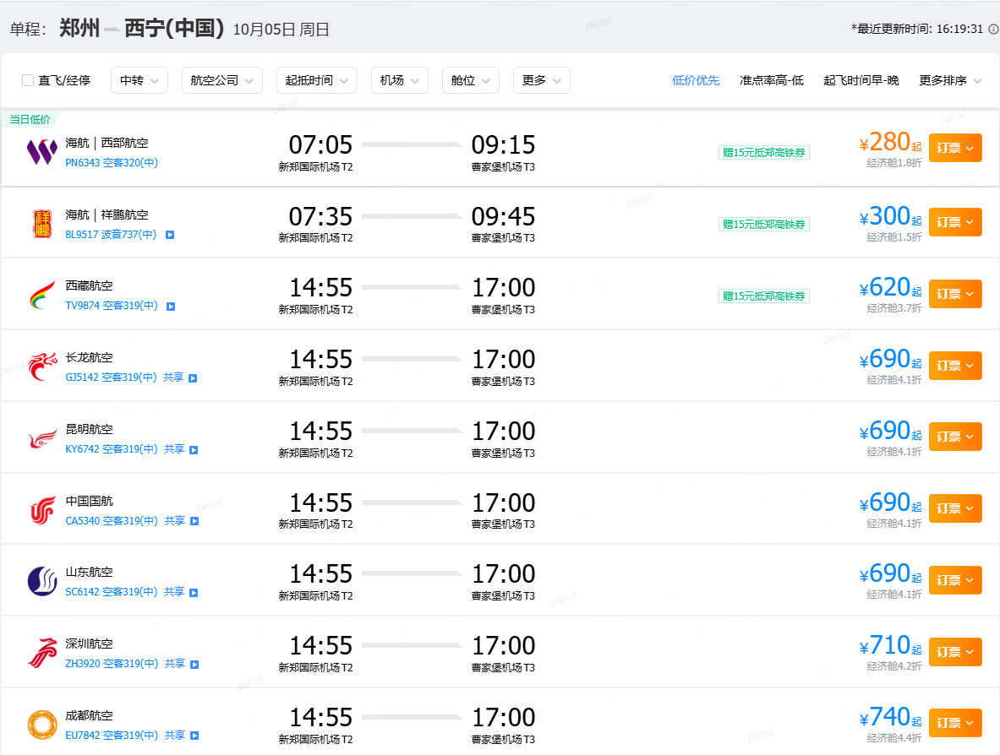

# 国庆

- [国庆](#国庆)
  - [DAY1 ~ DAY3 石家庄](#day1--day3-石家庄)
    - [DAY1 从广州到石家庄](#day1-从广州到石家庄)
  - [DAY3 ~ DAY5 郑州](#day3--day5-郑州)
    - [DAY3 从石家庄到郑州](#day3-从石家庄到郑州)
    - [DAY3 胖东来](#day3-胖东来)
    - [DAY4 河南省博物院](#day4-河南省博物院)
  - [DAY5 ~ DAY11 青甘环线](#day5--day11-青甘环线)
    - [DAY5 从郑州到西宁](#day5-从郑州到西宁)
    - [青海湖南山观景台](#青海湖南山观景台)
    - [茶卡盐湖天空壹号](#茶卡盐湖天空壹号)
    - [鸣沙山月牙泉后山停车场](#鸣沙山月牙泉后山停车场)
    - [莫高窟数字展示中心（提前三天预约）](#莫高窟数字展示中心提前三天预约)
    - [大柴旦翡翠湖（盐湖一号）](#大柴旦翡翠湖盐湖一号)
    - [张掖丹霞北门](#张掖丹霞北门)
    - [U型公路 G315国道](#u型公路-g315国道)
    - [G315国道水上丹霞入口](#g315国道水上丹霞入口)
  - [附录](#附录)
    - [郑州-西宁](#郑州-西宁)

## DAY1 ~ DAY3 石家庄

### DAY1 从广州到石家庄

- 【广州 $\rightarrow$ 石家庄】
- 航班：CZ2185
- 时间：2025-10-01 17:25 - 20:05

## DAY3 ~ DAY5 郑州

### DAY3 从石家庄到郑州

- 【石家庄 $\rightarrow$ 郑州】
- 列车：G2055
- 时间：2025-10-03 12:35 - 14:49

### DAY3 胖东来

- 地址：郴州市北湖区兴旺街与国庆北路交叉口东100米
- 营业时间：
  - 周日-周四：09:30 - 21:00
  - 周五-周六：09:30 - 21:30
- 旅游时间：建议预留2-3小时

### DAY4 河南省博物院

- 地址：
- 票务：
- 时间：

## DAY5 ~ DAY11 青甘环线

### DAY5 从郑州到西宁

- 【郑州 $\rightarrow$ 西宁】
- 航班: 海航PN4363
- 时间：07:05 - 09:15
  
### 青海湖南山观景台

### 茶卡盐湖天空壹号

- 【西宁 -> 茶卡盐湖天空壹号】
- 自驾行程：300KM
- 耗时：4h

### 鸣沙山月牙泉后山停车场

### 莫高窟数字展示中心（提前三天预约）

### 大柴旦翡翠湖（盐湖一号）

### 张掖丹霞北门

### U型公路 G315国道

- 往里开2公里有官方停车区（免费）

### G315国道水上丹霞入口

## 附录

### 郑州-西宁

- 10月4日

- 10月5日
- 
