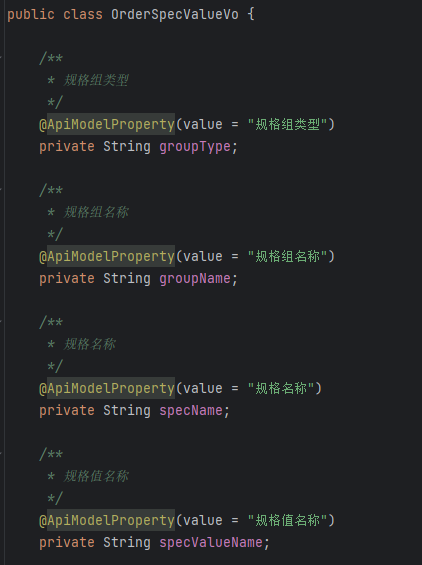
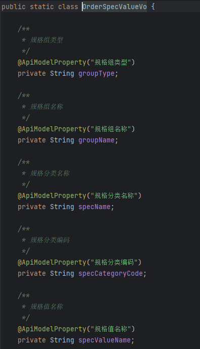

# 整车商城
## 存在的一些问题

### 应用结构本身存在的问题以及带来的缺陷
- 问题：使用了微服务的应用结构，但实际方案上在服务的拆分，以及服务资源分配的上存在与`微服务`相悖的错误。

### 业务代码上的
- 字段命名混乱，同一个字段名，在不同的地方有不同的含义。拿`specName`举例，一会是`规格名称`，一会又是`规格分类名称`（甚至注释写的是`规格分类名称`，但是实际赋值时又是使用`上一层的规格组分类名称`进行赋值），定义混乱，给代码阅读造成极大阻碍。
  - 订单列表中VO层对specName的解释
    
  - 订单配置详情中VO层对specName的解释
    
- 数据访问方式不规范，不同的service之间直接相互使用对方的Mapper直接进行访问entity。导致Entity -> DTO -> VO 此类的逻辑十分零散地分布在各处业务场景代码中。十分难以统一管理。（实际上若不同的service都可以直接访问对方对应的数据表，entity,DTO, VO等分层就已经是没有意义了）
