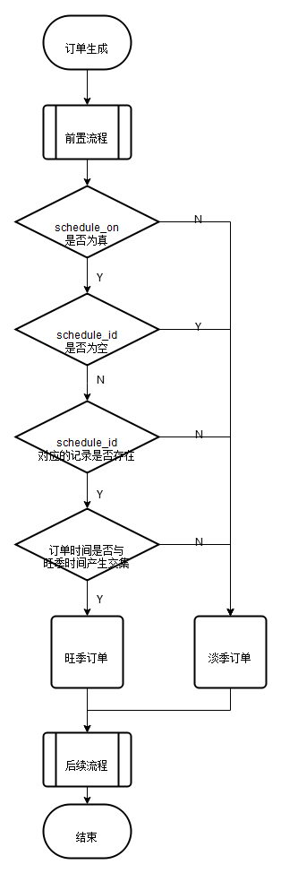

# 酒店二期需求&方案
## 需求点
### 增加“小鹏服务公司”收款主体
1. 方案：待支付中心支持后，我方进行配置并测试

### 日历筛选调整，可查日历范围扩展到最大91天，预定日期维持31天最大跨度
1. 解释：酒店商品可定范围扩大到91天，单笔订单最大预定天数维持在31天。
2. 方案：待定

### 支持纯现金，现金积分混合支付
1. 方案：待定

### 淡旺季配置扩展
1. 描述：
   1. 酒店支持淡旺季打开与关闭（信息点1）
      1. spu_hotel中增加slack_or_low字段标识酒店是否使用旺季配置
   2. 淡季期间酒店支持配置入住前N天可退（信息点2）
      1. spu_hotel中增加refundable_time_before_check_in
   3. 使用旺季时间表配置酒店旺季时间段（信息点3）
      1. 旺季时间表支持模板
      2. 酒店可以复用模板的配置，修改酒店的淡旺季配置不影响模板（酒店的配置为模板的镜像）
      3. 修改模板可以选择同步到酒店（将模板生成镜像用于覆盖酒店配置）
   4. 可退日期持久化到订单项（order_hotel_info）中，修改淡旺季配置不对既有订单产生影响
   5. 根据淡旺季时间筛选酒店：暂无此需求，但不排除以后会有（建议不适用json存储时间表）
   6. 配置时间长度：两年到三年左右

2. 旺季时间表说明
   1. **粒度**：最短时间段为1天，例如：2021-10-01 00:00:00 - 2021-10-02 00:00:00 为一个最短可配置时间长度
   2. **起始时间**：时间仅支持当天0点开始N天后0点结束(N>0,N$\in$Z)
   3. **合并**: 若有两个或以上配置时间相交或者相切，则将这两个配置合并在一起，合并后的时间起始时间为这些原有配置中，最早的起始时间，结束时间为最晚的结束时间。
   4. **过期数据**：将结束时间小于当前时间的时间段视为过期数据，应该予以删除（既有订单不依赖此数据）。
      1. **解释**:  设一个时间区间用集合 $T=\{t| t\in [t_s, t_e)\}$ 表示,$t_s$为时间段起始时间点，$t_e$为时间段结束时间点，有$t_s<t_e$。
   $$设有两个区间：T_1=\{t \in [t_1,t_2)\},T_2=\{t \in [t_3,t_4)\} $$  
   $$若t3 \in [t_1,t_2],且t_4\notin [t_1,t_2], 则 T_1 + T_2=T_3=\{t | t \in [t_1,t_4)\}$$
   $$若t3 \in [t_1,t_2],且t_4\in [t_1,t_2], 则 T_1+T_2=T_3=\{t | t \in [t_1,t_2)\}$$  
   
   5. 若使用json存储时间表，性能分析

      设用schedule字段存储时间表,格式为[{"start":1234567891234,"end":1234567891234},{"start":1234567891234,"end":1234567891234}……]  

      
      1. 目前毫秒级粒度的时间戳长度为13位数字，因此以上述格式为例，json长度表达式为：44*n+1 Byte（设使用ASCII编码）
      2. **最佳情况**：schedule字段为空json列表（没有旺季时间）,json长度为2字节
      3. **时长为1年的最坏情况**: schedule中共存放182或183个时间段配置 ，json长度平均一年为8030字节，占用空间8KB。假设时间配置表长度为2到3年，则取中间值，json的平均长度为20000字节，占用空间20KB.
      4. 表设计方案  
         |字段名:|id|template_id|schedule|is_public|create_uid|update_uid|create_time|update_time|
         |--|--|--|--|--|--|--|--|--|  
         |描述：|自增主键|业务主键|时间表|是否为公有时间表|uid|uid|创建时间|更新时间|  
         |类型：|bigint(22)|varchar(64)|json|tinyint(2)|varchar(32)|varchar(32)|datetime|datetime|  
         |默认值||||2|||||

   6. 将时间段信息离散存储在数据库中，性能分析
      1. **最佳情况**：没有配置旺季时间，则表中没有内容  
      2. **最坏情况**：
         1. 背景：每个酒店拥有自己的时间表，模板时间表视为一个抽象酒店的时间表。某个酒店应用某个时间表模板是将模板的时间表拷贝一份到自己的时间表，这样的好处为：不同酒店之间的淡旺季时间表不互相影响。  
         2. 分析：若每个时间表都处于最坏的设置情况，则一年的时间表长度为182行（每行存储一个旺季时间段），因此在平均为2.5年长的配置中，一个时间表平均需要455行用于存储表项。且由于数据库采取软删除策略，因此随着时间的推移，每个时间表的表项将会主键增加。最坏情况下，每次修改均为全量修改，即产生455行软删除数据。若酒店数量为20个，则每个酒店均修改时间表后，将产生18,200行数据。
   7. 总结：使用离散存储的方式对比json存储的优势在于，当想通过时间筛选淡旺季酒店时，便于操作。实现简单，缺点：容易产生大量冗余数据，例如

## 设计细节
### 旺季时间表及其相关配套
1. spu_hotel模型扩充三个字段，分别为：`schedule_id`,`refundable_time`,`schedule_on`。  
   - `schedule_id`：用于关联旺季时间表，
   - `refundable_time`：用于配置酒店淡季订单，入住前多少天前可退，默认值设为1天。
   - `schedule_on`：用于配置酒店是否启用旺季时间表，若不启用，则所有时间段均为淡季。

2. 新模型boom_season_schedule  
   该模型有4个主要功能字段`schedule_id`,`schedule_name`,`schedule`,`is_public`    
   `schedule_id`：时间表id，业务主键，用于唯一标识一个时间表  
   `schedule_name`：时间表名称，用于时间表模板名展示  
   `schedule`：时间表配置列表，为json格式，  
   `is_public`：用于标识是否为公有模板，  
3. 订单产生流程  
     
   说明：淡旺季订单没有本质区别，区别在订单项目中的cancel_end_time的时间节点不同。