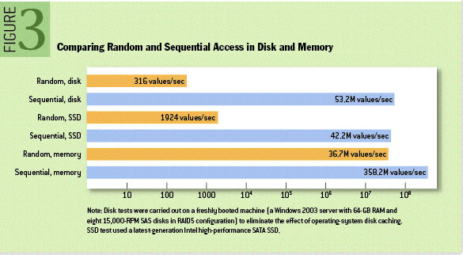
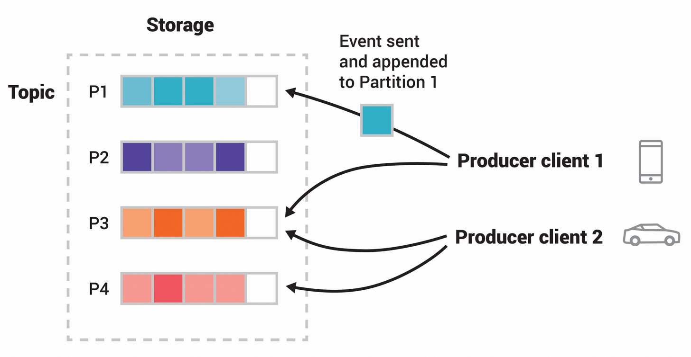

# kafka

## 为何kafka使用磁盘对数据进行持久化处理依然能很快

### 1. 顺序读写

kafka重度依赖文件系统以用于消息的持久化，但依然能做到如此高吞吐量的核心在于kafka将磁盘写入优化为顺序写入即顺序I/O模式，从而充分利用了磁盘顺序写入大吞吐量的优势，避免了寻道延迟。

在一个由六块7200转/分的磁盘组成的raid-5系统中，顺序写入性能能达到 600MB/sec, 但是随机写入只有 100kB/sec

> The key fact about disk performance is that the throughput of hard drives has been diverging from the latency of a disk seek for the last decade.As a result the performance of linear writes on a JBOD configuration with six 7200rpm SATA RAID-5 array is about 600MB/sec but the performance of random writes is only about 100k/sec—a difference of over 6000X

### 2. 操作系统优化 —— read-ahead 和 write-behind 技术

- read-ahead: 操作系统将预先取出比当实际请求更多的数据，后面的顺序访问将因此得到优化。

- write-behind： 操作系统将多个小型写入操作缓存起来，然后批量执行，从而减少实际的物理I/O操作次数。

在[ACM Queue](https://queue.acm.org/detail.cfm?id=1563874)这篇文章里有提到有些时候顺序磁盘访问要比随机内次访问更快

为了补偿这种性能差异，现代操作系统在使用内存进行磁盘缓存方面变得越来越激进。现代操作系统会毫不犹豫地将所有空闲的内存用于磁盘缓存，所有的磁盘读写操作都将通过这统一的缓存进行。

除此之外，由于Kafka使用java实现并且运行在JVM上，

- java对象的内存开销很大，通常是存储数据本身的两倍大小甚至更多。
- 随着堆内存的增加GC会变得越来越频繁，越来越慢。

基于以上因素，直接使用文件系统并依靠页面缓存（操作系统——虚拟内存优化）优于维护内存缓存或者其他结构。

因此Kafka直接将消息log写入到日志文件中，（实际上磁盘文件对应的分页缓存中）由操作系统实现内存-->磁盘的持久化操作。

### 3. 零拷贝技术

## Kafka Topic概念

在kafka中，事件是按照Topic来进行管理与持久化的，Topic类似于文件系统中的文件夹，一个Topic下可以有0到多个生产者和和消费者。

kafka中可以针对Topic设置消息保留时间，超过保留时间

## Kafka分区概念

一个Topic下可以有多个分区，消息将会被分发到不同的分区中，对应不同的Kafka brokers。当一个消息被发到Topic，实际上它将会被appended到这个Topic的其中一个分区中。

**Event Key**：拥有相同Event Key的消息将会写入相同的分区。（生产者指定Event key）

**消息顺序**：kafka保证同一个分区中的消息是有序的，即消费顺序与生产顺序相同，但不保证不同分区之间的消息顺序。

>Figure: This example topic has four partitions P1–P4. Two different producer clients are publishing, independently from each other, new events to the topic by writing events over the network to the topic's partitions. Events with the same key (denoted by their color in the figure) are written to the same partition. Note that both producers can write to the same partition if appropriate.

## Kafka消费模式

## kafka架构

## kafka持久化策略

## kafka高性能的原因

- 磁盘顺序I/O
- 零拷贝

## kafka分区的概念

## 为何kafka高可扩展

生产者与消费者互相解耦
