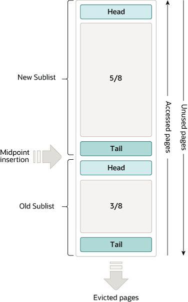

# InnoDB 内存结构 —— Buffer Pool

## 简介

InnoDB的缓冲池是主内存的一个区域，InnoDB会将访问中的表与索引数据缓存到这里。缓冲池允许直接从内存中访问那些常用的数据，从而加快处理速度。在专用的 DB 服务器上，通常会将超过80%的内存分配给缓冲池。

为了提高大容量读取操作的效率，缓冲池被划分为多个页，每个分页可以容纳多行数据。为了提高缓存管理的效率，缓冲池通过链表页的方式实现。访问频次低的数据会通过最近最少使用算法（LRU）的变体从缓冲池中移出。

了解如何利用缓冲池让高频访问的数据保持在内存中，是 MySQL 调优中的一个重要方面。

## Buffer Pool 中的LRU算法

缓冲池通过一个LRU的变体算法以列表的形式进行管理。当需要空间向缓冲池中添加新的页面时，最近最少被使用的页会被驱除出缓冲池, 并且新的页会被添加到列表中间位置，这种中间（midpoint）插入的策略将列表视作两个子列表。

- 在 head 部分，是近期访问的新（“young”）页面子列表。
- 在 tail 部分，是最近访问次数较少的旧页面子列表。



该算法将常用页面保持在 New 子列表中，Old 子列表中则包含使用频率较低的页面。Old 子列表中的这些页面可能会被删除。默认情况下，该算法的操作如下

- 缓冲池的 3/8 会被用做 Old 子列表。
- 中点（midpoint）位于列表中 New 子列表的尾部与 Old 子列表的头部之间。
- 当 InnoDB将页读入缓冲池中时，一开始会插入到 midpoint 的位置（Old 子列表的头部）。读页面的原因可能是用户发起的操作（例如SQL查询）需要用到该页面，也可能是 InnoDB 自动执行 [read-ahead](https://dev.mysql.com/doc/refman/8.4/en/glossary.html#glos_read_ahead) 操作的一部分。
- 访问一个 Old 子列表中的页会使得它变得年轻（"young"），并且会将这个页面移动到 New 子列表的头部。如果页面是因为 read-ahead 操作被读入缓冲池的，页面访问可能不会立即发生，甚至在页面被驱逐之前都不会发生。
- 随着数据库的运行，缓冲池中未被访问到的页面会老化，并向列表的末端移动。并且New 子列表与 Old 子列表中的页面都会随着其他新页面的创建而老化。Old 子列表同样也会随着 midpoint 中插入页面而老化。最终，一个未被使用的页面会到达 Old 子列表的末尾并被移除。

默认情况下，查询命中的页面会被立即移动到 New 子列表中，意味着它们会在 缓冲池中停留更长时间。执行[mysqldump](https://dev.mysql.com/doc/refman/8.4/en/mysqldump.html)操作，或者执行一个没有where条件的select语句时，会触发表扫描。表扫描会将大量（新）数据带入缓冲池，并驱逐等量的旧数据，哪怕这些新数据之后再也不会被使用。类似的，页面会被 read-ahead 后台线程加载，且只要发生过一次访问，这个页面就会被移动到 new 子列表的头部。这些情况都会将那些真正频繁被使用的页面推到 Old 子列表中，从而成为被驱逐的对象。更多关于优化这种行为的内容，可以参见 MySQL 的官方文档  [Section 17.8.3.3, “Making the Buffer Pool Scan Resistant”](https://dev.mysql.com/doc/refman/8.4/en/innodb-performance-midpoint_insertion.html) 和 [Section 17.8.3.4, “Configuring InnoDB Buffer Pool Prefetching (Read-Ahead)”](https://dev.mysql.com/doc/refman/8.4/en/innodb-performance-read_ahead.html)。

InnoDB 的标准监视器（Standard Monitor）输出中，关于缓冲池的 LRU 算法操作的一些字段在 BUFFER POOL AND MEMORY 部分中。关于这部分的细节，可以参见MySQ官方文档 [Monitoring the Buffer Pool Using the InnoDB Standard Monitor](https://dev.mysql.com/doc/refman/8.4/en/innodb-buffer-pool.html#innodb-buffer-pool-monitoring).

Buffer Pool 的配置
缓冲池提供了各个方面的配置，你可以通过调整它们来提升性能。

- 理想情况下：应将缓冲池的尺寸设置得尽可能大，这样既可以保证服务器上的其它进程有足够的内存运行，又不会造成过多的页面交换。缓冲池越大，InnoDB 就越像一个内存数据库 （in-memory database）,访问的数据只从磁盘中读取一次，然后在随后的读取中都通过内存获取数据。更多关于如何调整缓冲池大小的内容，可以参阅MySQL的文档 [Section 17.8.3.1, “Configuring InnoDB Buffer Pool Size”](https://dev.mysql.com/doc/refman/8.4/en/innodb-buffer-pool-resize.html)。

- 在一个内存资源充足的64位系统中，你可以将缓冲池分割成多个部分，以最大限度地减少并发操作之间对内存结构的争用。更多关于这部分的信息，可以参阅 [Section 17.8.3.2, “Configuring Multiple Buffer Pool Instances”](https://dev.mysql.com/doc/refman/8.4/en/innodb-multiple-buffer-pools.html)。

- 你可以将经常被访问的数据保持在内存中，而无需担心操作带来的突发活动高峰会将大量不常用数据带入 缓冲池。更多细节请看 [Section 17.8.3.3, “Making the Buffer Pool Scan Resistant”](https://dev.mysql.com/doc/refman/8.4/en/innodb-performance-midpoint_insertion.html)。

- 你可以控制何时以及如何执行 read-ahead 请求，以异步的方式将页面预加载到缓冲池中，以备将来需要时使用。更多细节可查看 [Section 17.8.3.4, “Configuring InnoDB Buffer Pool Prefetching (Read-Ahead)”](https://dev.mysql.com/doc/refman/8.4/en/innodb-performance-read_ahead.html)。

- 你可以控制后台刷新何时发生，以及是否根据工作负载调整刷新速率。更多细节可查看 [Section 17.8.3.5, “Configuring Buffer Pool Flushing”](https://dev.mysql.com/doc/refman/8.4/en/innodb-buffer-pool-flushing.html)。

- 你可以配置 InnoDB 如何保存当前缓冲池的状态，以避免服务器重启后出现过长的预热过程。更多细节可查看 [Section 17.8.3.6, “Saving and Restoring the Buffer Pool State”](https://dev.mysql.com/doc/refman/8.4/en/innodb-preload-buffer-pool.html)。

通过 InnoDB 标准监视器监控 Buffer Pool
InnoDB标准监视器输出可以通过`SHOW ENGINE INNODB STATUS`命令进行访问。它提供了有关缓冲池运行情况的指标。缓冲池的运行指标在 InnoDB 标准监视器输出的 `BUFFER POOL AND MEMORY` 部分。

```Plain Text
----------------------
BUFFER POOL AND MEMORY
----------------------
Total large memory allocated 2198863872
Dictionary memory allocated 776332
Buffer pool size   131072
Free buffers       124908
Database pages     5720
Old database pages 2071
Modified db pages  910
Pending reads 0
Pending writes: LRU 0, flush list 0, single page 0
Pages made young 4, not young 0
0.10 youngs/s, 0.00 non-youngs/s
Pages read 197, created 5523, written 5060
0.00 reads/s, 190.89 creates/s, 244.94 writes/s
Buffer pool hit rate 1000 / 1000, young-making rate 0 / 1000 not
0 / 1000
Pages read ahead 0.00/s, evicted without access 0.00/s, Random read
ahead 0.00/s
LRU len: 5720, unzip_LRU len: 0
I/O sum[0]:cur[0], unzip sum[0]:cur[0]
```

下面这张表描述了InnoDB 标准监视器给出关于缓冲池运行的各个指标。

InnoDB标准监视器提供的“每秒平均值”是基于自上次打印以来经过的时间计算的。

## InnoDB缓冲池监控指标

|字段名称|描述|
|---|---|
|Total memory allocated| 分配给缓冲池的总共内存大小（以字节为单位）。|
|Dictionary memory allocated| 为InnoDB数据字典分配的总共内存大小（以字节为单位）。|
|Buffer pool size| 分配给缓冲池的页面数量。|
|Free buffers| 缓冲池空闲列表（free list）的页面数量。|
|Database pages| 缓冲池LRU列表的总页数。|
|Old database pages| 缓冲池旧LRU子列表（old LRU sublist）的页面数量。|
|Modified db pages| 缓冲池当前已修改的页面数。|
|Pending reads| 等待读入缓冲池的缓冲池页面数量。|
|Pending writes LRU| 缓冲池中LRU列表底部中，需要写入的旧脏页面数。|
|Pending writes flush list| 需要在checkpoiting刷新的缓冲池页面数。|
|Pending writes single page| 缓冲池中待处理的独立页面写入数量。|
|Pages made young| 在缓冲池中标记为young的页面总数（移动到 new 子列表头部的页面数）。|
|Pages made not young| 在缓冲池中不被变young的页面总数（那些一直被保持在 old 子列表没有被标记为 young 的页面数）。|
|youngs/s| 平均每秒，访问到缓冲池 LRU 列表 old 页面，并使得页面变young的次数。更多信息可以看这个表格后面的注释。|
|non-youngs/s| 平均每秒，访问到缓冲池 LRU 列表 old 页面，但并没有使得页面变young的次数。更多信息请查看表格下方的注释。|
|Pages read| 从缓冲池读取的页面总数。|
|Pages created| 在缓冲池中创建的页面总数。|
|Pages written| 从缓冲池写入的页面总数。|
|reads/s| 平均每秒缓冲池页面读取次数。|
|creates/s| 平均每秒创建的缓冲池页面数。|
|writes/s| 平均每秒缓冲池页面的写入次数。|
|Buffer pool hit rate| 缓冲池页面命中率——从缓冲池访问页面的次数/从磁盘访问页面的次数。|
|young-making rate| 使页面变Young的页面访问次数/总的页面访问次数。更多信息请查看表格下方的注释。|
|not (young-making rate)| 没能使页面变Young的页面访问次数/总的页面访问次数。更多信息请查看表格下方的注释。|
|Pages read ahead| 平均每秒的read-ahead操作次数。|
|Pages evicted without access| 平均每秒缓冲池中被驱逐的未访问过的页面数。|
|Random read ahead| 平均每秒read-ahead操作的随机访问次数。|
|LRU len| 缓冲池 LRU 列表的大小。|
|unzip_LRU len| 缓冲池 unzip_LRU 列表的大小（以页面数计）。|
|I/O sum| 缓冲池 LRU 列表的访问总次数。|
|I/O cur| 当前时间间隔内访问缓冲池 LRU 列表的总数。|
|I/O unzip sum| 缓冲池 unzip_LRU 列表中已解压的页面总数。|
|I/O unzip cur| 当前时间间隔中，缓冲池 unzip_LRU 列表中已解压的页面总数。|

### 注释

- youngs/s 指标仅用于旧页面。它基于页面访问的次数。一个页面可以被访问多次，但每次访问都被计算在内。当没有大范围扫描时，如果你看到这个数值非常低，可以考虑减少延迟时间 (delay value) 或增加 old 子列表在缓冲池中的占用比例。增加 old 子列表的占用比例从而延长该子列表中页面移动到尾部所需要的时间，进而增加这些页面因再次被访问而变young的概率。更多内容请看 [Section 17.8.3.3, “Making the Buffer Pool Scan Resistant”](https://dev.mysql.com/doc/refman/8.4/en/innodb-performance-midpoint_insertion.html)。

- non-youngs/s 指标同样也是仅适用于旧页面。计算方式和 youngs/s 类似。当发生大范围扫描时（并且同时有较高的 youngs/s 数值），如果你没有看到该指标有较高的值，可以增大延迟时间 (delay value)。更多信息请看[Section 17.8.3.3, “Making the Buffer Pool Scan Resistant”](https://dev.mysql.com/doc/refman/8.4/en/innodb-performance-midpoint_insertion.html)。

- 新页面生成率统计的是所有缓冲池页面的访问，而不仅仅是旧子列表中页面的访问。新页面生成率和非新页面生成率通常不等于缓冲池的总命中率。旧子列表中的页面命中会导致页面移动到新子列表，但新子列表中的页面命中只有在距离列表头部一定距离时才会移动到列表头部。

- 非新生页面生成率（not (young-making rate)）是指页面访问未导致页面变为新生页面的平均命中率，原因包括：未满足 innodb_old_blocks_time 定义的延迟时间，或新子列表中的页面访问未导致页面被移至头部。该比率统计了所有缓冲池页面访问，而不仅仅是旧子列表中的页面访问。

缓冲池[服务器状态变量](https://dev.mysql.com/doc/refman/8.4/en/server-status-variables.html)和 [INNODB_BUFFER_POOL_STATS](https://dev.mysql.com/doc/refman/8.4/en/information-schema-innodb-buffer-pool-stats-table.html) 表提供了许多与 InnoDB 标准监视器输出中相同的缓冲池指标。有关更多信息，请参阅示例 [Example 17.10, “Querying the INNODB_BUFFER_POOL_STATS Table”](https://dev.mysql.com/doc/refman/8.4/en/innodb-information-schema-buffer-pool-tables.html#innodb-information-schema-buffer-pool-stats-example).
