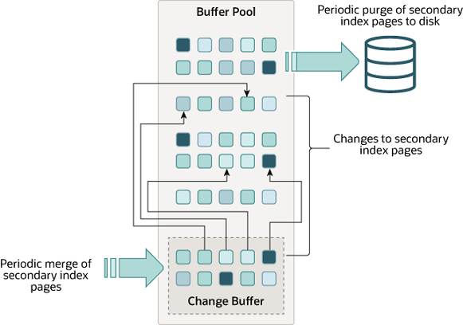

# Change Buffer （变更缓冲区）

## 简介

变更缓冲区（Change Buffer）是一个特殊的内存结构，当二级索引页没有在缓冲池（Buffer Pool）中时，用于缓存对二级索引页的变更操作。缓冲区的变更操作可能由 INSERT, DELETE 或 UPDATE 语句（DML）操作引起。过后当这些二级索引页被其他读操作加载到缓冲池中时，变更缓冲区中暂存起来的变更操作就会被应用到这些页上。

与聚簇索引不同，二级索引通常是不具有唯一性的，并且二级索引的插入通常以随机顺序进行。因此删除和更新二级索引时，可能会作用于索引树相邻的分页上。这种当变更页读入到缓冲池（Buffer Pool）时，才用变更操作的延迟应变更机制，避免了将二级索引页从磁盘读入缓冲池的大量随机I/O操作。

