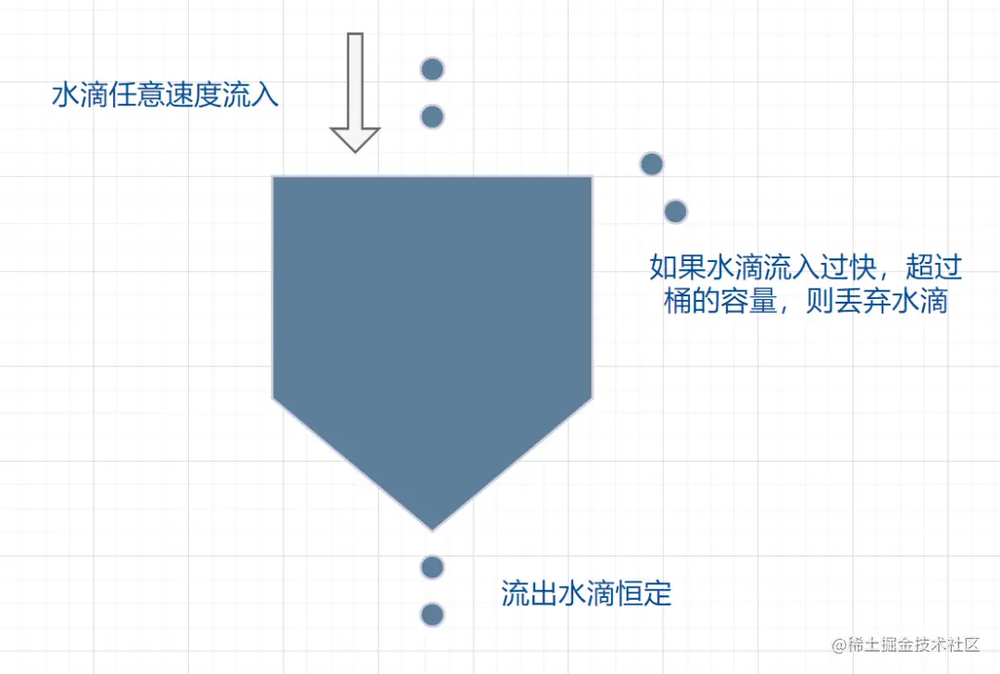

# 1. 限流组件中通常涉及到的问题

- [1. 限流组件中通常涉及到的问题](#1-限流组件中通常涉及到的问题)
  - [1.1. 限流的概念](#11-限流的概念)
  - [1.2. 有哪些常见的限流算法？](#12-有哪些常见的限流算法)
  - [1.3. 固定时间窗口限流算法](#13-固定时间窗口限流算法)
    - [1.3.1. 什么是固定时间窗口限流算法？](#131-什么是固定时间窗口限流算法)
    - [1.3.2. 固定时间窗口算法的优缺点](#132-固定时间窗口算法的优缺点)
    - [1.3.3. 固定时间窗口的适用场景](#133-固定时间窗口的适用场景)
    - [1.3.4. 固定时间窗口算法的伪代码实现](#134-固定时间窗口算法的伪代码实现)
  - [1.4. 滑动时间窗口限流算法](#14-滑动时间窗口限流算法)
    - [1.4.1. 什么是滑动时间窗口限流算法？](#141-什么是滑动时间窗口限流算法)
    - [1.4.2. 滑动时间窗口算法的优缺点](#142-滑动时间窗口算法的优缺点)
    - [1.4.3. 滑动时间窗口算法的适用场景](#143-滑动时间窗口算法的适用场景)
    - [1.4.4. 滑动时间窗口算法的伪代码实现](#144-滑动时间窗口算法的伪代码实现)
  - [1.5. 令牌桶算法](#15-令牌桶算法)
    - [1.5.1. 令牌桶算法的原理是什么？](#151-令牌桶算法的原理是什么)
    - [1.5.2. 令牌桶算法的优缺点是什么？](#152-令牌桶算法的优缺点是什么)
    - [1.5.3. 令牌桶适用场景](#153-令牌桶适用场景)
    - [1.5.4. 令牌桶的伪代码实现](#154-令牌桶的伪代码实现)
  - [1.6. 漏桶算法](#16-漏桶算法)
    - [1.6.1. 漏桶算法的原理是什么？](#161-漏桶算法的原理是什么)
    - [1.6.2. 漏桶算法的优缺点是什么？](#162-漏桶算法的优缺点是什么)
    - [1.6.3. 漏桶算法的适用场景是什么？](#163-漏桶算法的适用场景是什么)
    - [1.6.4. 漏桶算法的伪代码实现](#164-漏桶算法的伪代码实现)
  - [1.7. 谈谈令牌桶算法漏桶算法的区别？](#17-谈谈令牌桶算法漏桶算法的区别)
  - [1.8. 谈谈固定窗口与滑动时间窗口算法的区别？](#18-谈谈固定窗口与滑动时间窗口算法的区别)
  - [1.9. 上述这些限流算法它们各自的特点以及适用的场景有哪些？](#19-上述这些限流算法它们各自的特点以及适用的场景有哪些)
  - [1.10. 有哪些常见的限流策略](#110-有哪些常见的限流策略)
  - [1.11. 你是否了解资源池隔离限流策略，说说它的细节？](#111-你是否了解资源池隔离限流策略说说它的细节)
  - [1.12. 你是否了解控制并发线程数的限流策略，说说它的细节？](#112-你是否了解控制并发线程数的限流策略说说它的细节)
  - [1.13. 你了解Sentinel吗？它是如何实现限流的？](#113-你了解sentinel吗它是如何实现限流的)
  - [1.14. 你了解Hystrix吗？它是如何实现限流的？](#114-你了解hystrix吗它是如何实现限流的)
  - [1.15. 你在项目中是如何使用限流组件的？遇到过哪些问题，如何解决的？](#115-你在项目中是如何使用限流组件的遇到过哪些问题如何解决的)
  - [1.16. 在分布式系统中，如何保证限流组件的高可用性和一致性？](#116-在分布式系统中如何保证限流组件的高可用性和一致性)

## 1.1. 限流的概念

限流就是对请求或者并发数进行限制；通过对一个时间窗口内的请求量进行控制，来保护系统资源，防止系统过载崩溃。

## 1.2. 有哪些常见的限流算法？

常见的限流算法有：

- 固定时间窗口
- 滑动时间窗口
- 令牌桶算法
- 漏桶算法
- 滑动日志算法

## 1.3. 固定时间窗口限流算法

### 1.3.1. 什么是固定时间窗口限流算法？

固定时间窗口算法又叫`计数器算法`。主要通过一个支持原子操作的计数器来累计一个固定时间间隔内的请求数或者并发数。当该时间间隔内计数达到限流阈值时，出发拒绝策略，没过一个时间间隔就重置计数器。

### 1.3.2. 固定时间窗口算法的优缺点

- **优点**: 实现简单，易于理解和使用。
- **缺点**:
  - **流量不均匀**：边界问题严重：在两个时间窗口的交界处，可能会出现短时间内请求数激增的情况，导致限流不准确。
  - **应对突发流量能力差**：无法平滑处理突发流量，可能会导致服务在短时间内承受过大的压力。

### 1.3.3. 固定时间窗口的适用场景

- 对时间敏感度要求不高、需要简单实现且能容忍一定流量突变（如在窗口边缘）的场景。
- 简单的流量控制：当只需要对整体时间段内的请求量进行限制时，固定时间窗口限流是一种简单易懂的实现方式。

### 1.3.4. 固定时间窗口算法的伪代码实现

```python
class FixedWindowRateLimiter:
    def __init__(self, max_requests, window_size):
        self.max_requests = max_requests
        self.window_size = window_size
        self.request_count = 0
        self.window_start = time.time()

    # 这里需要保证is_allowed方法的原子性才是正确的
    def is_allowed(self):
        current_time = time.time()
        if current_time - self.window_start >= self.window_size:
            self.request_count = 0
            self.window_start = current_time

        if self.request_count < self.max_requests:
            self.request_count += 1
            return True
        else:
            return False
```

## 1.4. 滑动时间窗口限流算法

### 1.4.1. 什么是滑动时间窗口限流算法？

滑动时间窗口算法是对固定时间窗口算法的改进。它通过维护一个时间窗口内的请求记录，来动态计算当前时间窗口内的请求数。具体实现上，滑动时间窗口算法通常会使用一个链表或者队列来存储请求的时间戳，当新的请求到来时，先将过期的请求时间戳移除，然后再判断当前时间窗口内的请求数是否超过限流阈值。

### 1.4.2. 滑动时间窗口算法的优缺点

- **优点**: 能够更准确地反映当前的请求情况，避免了固定时间窗口算法在窗口交界处的突发请求问题。
- **缺点**: 实现相对复杂，维护请求时间戳的开销较大。

### 1.4.3. 滑动时间窗口算法的适用场景

适用于对请求速率要求较高且需要平滑限流的场景，例如API网关、微服务等。

### 1.4.4. 滑动时间窗口算法的伪代码实现

```python
class SlidingWindowRateLimiter:
    def __init__(self, max_requests, window_size):
        self.max_requests = max_requests
        self.window_size = window_size
        self.request_timestamps = []

    def is_allowed(self):
        current_time = time.time()
        # 移除过期的请求时间戳
        while self.request_timestamps and self.request_timestamps[0] <= current_time - self.window_size:
            self.request_timestamps.pop(0)

        if len(self.request_timestamps) < self.max_requests:
            self.request_timestamps.append(current_time)
            return True
        else:
            return False
```

## 1.5. 令牌桶算法

### 1.5.1. 令牌桶算法的原理是什么？

它维护一个固定容量的令牌桶，按照固定速率往桶中添加令牌，每当有请求到来时，消耗一个令牌，如果桶中没有足够的令牌，则触发拒绝策略。

### 1.5.2. 令牌桶算法的优缺点是什么？

- **优点**:
  - **公平性**：由于每个请求都需要消耗一定数量的令牌才能被处理，因此所有请求都能够获得公平的机会被处理。
  - **灵活性**：可以通过调整令牌的添加速率和容量大小来适应不同的业务需求和性能指标要求。
  - **可预测性**：由于令牌的添加速率是预先设定好的，因此可以根据系统的性能指标和业务需求来预测未来的流量情况，并提前做好准备。
  - **应对突发流量**：由于令牌桶算法允许一定数量的请求在短时间内被处理，因此能够有效应对突发流量。

- **缺点**：
  - **复杂度比较高**：实现起来相对复杂，需要考虑的细节比较多，比如令牌的添加方式，容量大小等。
  - **可能导致请求延迟**：由于请求需要等待令牌的释放，可能会引入额外的延迟，影响用户体验。
  - **可能导致请求丢失**：如果突发流量过大，可能会导致令牌桶中的令牌被迅速消耗完，进而导致请求被拒绝或者丢失。
  
### 1.5.3. 令牌桶适用场景

根据令牌桶算法的主要特点，它主要适用于：需要控制平均处理速率，但允许一定程度的突发流量的场景

### 1.5.4. 令牌桶的伪代码实现

```python
class TokenBucketRateLimiter:
    def __init__(self, max_tokens, refill_rate):
        self.max_tokens = max_tokens
        self.refill_rate = refill_rate
        self.current_tokens = max_tokens
        self.last_refill_time = time.time()

    def is_allowed(self):
        current_time = time.time()
        # 计算自上次补充令牌以来经过的时间
        elapsed_time = current_time - self.last_refill_time
        # 计算应补充的令牌数量
        tokens_to_add = int(elapsed_time * self.refill_rate)
        if tokens_to_add > 0:
            self.current_tokens = min(self.max_tokens, self.current_tokens + tokens_to_add)
            self.last_refill_time = current_time

        if self.current_tokens > 0:
            self.current_tokens -= 1
            return True
        else:
            return False
```

## 1.6. 漏桶算法

### 1.6.1. 漏桶算法的原理是什么？

漏桶算法维护一个固定容量的漏桶，按照固定速率从桶中漏出请求，当有请求到来时，如果桶未满，则将请求放入桶中，否则触发拒绝策略。漏桶算法能够平滑处理请求流量，防止突发流量对系统造成冲击。

漏桶算法面对限流时，可以缓存一定的请求，不用直接粗暴拒绝。本质上和等待队列/消队列是一样的。



### 1.6.2. 漏桶算法的优缺点是什么？

- **优点**:
  - **能够平滑处理请求流量**：能够平滑处理突发流量，允许一定程度的请求突发，可以避免服务因瞬间高并发请求而过载。
  - **稳定性比较好**：能稳定控制流量出口速率，保护后端服务不被突发流量冲击。

- **缺点**:
  - **无法应对突发流量**: 由于漏出的速率是固定的，可能会导致无法利用系统空闲能力来处理突发的高峰流量
  - **可能引起数据丢失**: 当入口流量过大时，桶满后的请求即使系统仍有空闲能力也会因溢出被丢弃，不适用于对数据丢失敏感的场景。
  - **灵活性差，比较低的资源利用率**： 在低负载情况下，即使系统有能力快速处理请求，也必须按照固定的速率出水，造成资源浪费。
  - **请求延迟**： 由于请求需要排队等待出水，可能会引入额外的延迟，影响用户体验。

### 1.6.3. 漏桶算法的适用场景是什么？

漏桶算法适用于需要强制恒定速率处理请求、平滑流量输出的场景，例如在调用第三方系统时，防止自身请求量过大导致对方系统崩溃；也适用于网络流量控制，如平滑网络接口的访问量

### 1.6.4. 漏桶算法的伪代码实现

```python
class LeakyBucketRateLimiter:
    def __init__(self, max_capacity, leak_rate):
        self.max_capacity = max_capacity
        self.leak_rate = leak_rate
        self.current_capacity = 0
        self.last_leak_time = time.time()

    def is_allowed(self):
        current_time = time.time()
        # 计算自上次漏水以来经过的时间
        elapsed_time = current_time - self.last_leak_time
        # 计算应漏出的请求数量
        leaked_requests = int(elapsed_time * self.leak_rate)
        if leaked_requests > 0:
            self.current_capacity = max(0, self.current_capacity - leaked_requests)
            self.last_leak_time = current_time

        if self.current_capacity < self.max_capacity:
            self.current_capacity += 1
            return True
        else:
            return False
```

## 1.7. 谈谈令牌桶算法漏桶算法的区别？

## 1.8. 谈谈固定窗口与滑动时间窗口算法的区别？

## 1.9. 上述这些限流算法它们各自的特点以及适用的场景有哪些？

## 1.10. 有哪些常见的限流策略

## 1.11. 你是否了解资源池隔离限流策略，说说它的细节？

## 1.12. 你是否了解控制并发线程数的限流策略，说说它的细节？

## 1.13. 你了解Sentinel吗？它是如何实现限流的？

## 1.14. 你了解Hystrix吗？它是如何实现限流的？

## 1.15. 你在项目中是如何使用限流组件的？遇到过哪些问题，如何解决的？

## 1.16. 在分布式系统中，如何保证限流组件的高可用性和一致性？
